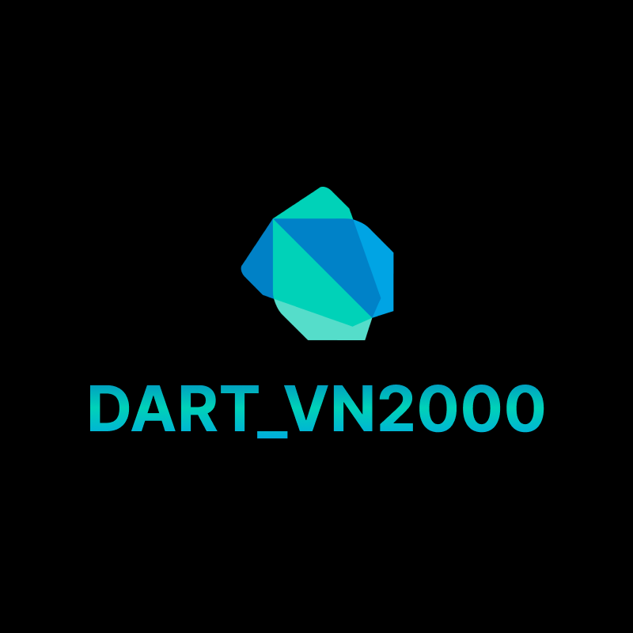

<!-- 
This README describes the package. If you publish this package to pub.dev,
this README's contents appear on the landing page for your package.

For information about how to write a good package README, see the guide for
[writing package pages](https://dart.dev/guides/libraries/writing-package-pages). 

For general information about developing packages, see the Dart guide for
[creating packages](https://dart.dev/guides/libraries/create-library-packages)
and the Flutter guide for
[developing packages and plugins](https://flutter.dev/developing-packages). 
-->

VN2000 converter for dart



## Features

- VN2000 to WGS84
- WGS84 to VN2000

## Getting started

```
dependencies:
  proj4dart: {version}
```

## Usage

```dart
void main() {
  final vn2000ToWGS84 = DartVN2000Converter.vn2000ToWGS84(
    dx: 600997,
    dy: 1189964,
    province: VN2000Province.VN2000_TP_HCM,
  );

  final wgs84ToVN2000 = DartVN2000Converter.wgs84ToVN2000(
    longitude: 106.67523783,
    latitude: 10.75909134,
    province: VN2000Province.VN2000_TP_HCM,
  );
  print(vn2000ToWGS84);
  print(wgs84ToVN2000);
}
```

## Additional information
Base on JS version (thank @namlunkaka): https://github.com/namlunkaka/vn2000-converter
